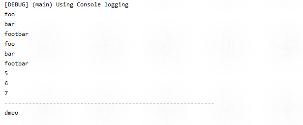

# Reactor的核心功能
```text
    Reactor项目的主要工件是react-core，这是一个反应式库，专注于Reactive Streams规范，并针对Java 8。
    Reactor引入了可实现的反应式类型，这些类型不仅实现了Publisher，而且还提供了丰富的运算符词汇：Flux和Mono。Flux对象表示0..N个项目
的反应序列，而Mono对象表示单值或空（0..1）结果。
    这种区别在类型中带有一些语义信息，表明异步处理的大致基数。例如，一个HTTP请求仅产生一个响应，因此进行计数操作没有多大意义。因此，
将HTTP调用的结果表示为Mono <HttpResponse>比将其表示为Flux <HttpResponse>更有意义，因为它仅提供与零项或一个项的上下文相关的运算
符。
    更改处理的最大基数的运算符也将切换为相关类型。例如，count运算符存在于Flux中，但是它返回Mono <Long>。           


```

## Flux 一个0-N项的异步序列项

下图显示了FLux如何转换项目：

```text
    Flux <T>是标准的Publisher <T>，代表从0到N个发射项目的异步序列，可以选择由完成信号或错误终止。与Reactive Streams规范一样，
这三种信号转换为对下游订户的onNext，onComplete和onError方法的调用。
    在可能的信号范围如此之大的情况下，Flux是通用的反应型。请注意，所有事件，甚至是终止事件，都是可选的：没有onNext事件，但onComplete
事件表示一个空的有限序列，但是删除onComplete则您有一个无限的空序列（除了围绕取消的测试以外，它没有什么用处）。同样，无限序列不一定为空。
例如，Flux.interval（Duration）产生Flux <Long>，它是无限的并从时钟发出规则的滴答声。
```

## Mono，异步0-1结果

The following image shows how a Mono transforms an item:


```text
    Mono <T>是专门的Publisher <T>，它发出最多一项，然后（可选）以onComplete信号或onError信号终。      
    它仅提供可用于Flux的运算符的子集，并且某些运算符（尤其是那些将Mono与另一个Publisher结合在一起的运算符）切换到Flux。
例如，Mono＃concatWith（Publisher）返回Flux，而Mono＃then（Mono）返回另一个Moo。
    它仅提供可用于Flux的运算符的子集，并且某些运算符（尤其是那些将Mono与另一个Publisher结合在一起的运算符）切换到Flux。例如，
Mono＃concatWith（Publisher）返回Flux，而Mono＃then（Mono）返回另一个Mono。  
    请注意，您可以使用Mono来表示仅具有完成概念（类似于Runnable）的无值异步过程。要创建一个，可以使用一个空的Mono <Void>。  

```

## 创建Flux或Mono并订阅的简单方法

开始使用Flux和Mono的最简单方法是使用在各自的类中发现的众多工厂方法之一。例如，要创建一个String序列，您可以枚举它们或将它们放入一个集合中，
并从中创建Flux，如下所示：
```java
        Flux<String> seql = Flux.just("foo", "bar", "footbar");
        List<String> iterable = Arrays.asList("foo", "bar", "footbar");
        Flux<Integer> numbersFromFiveToSeven = Flux.range(5, 3);
        seql.toStream().forEach(System.out::println);
        iterable.forEach(System.out::println);
        numbersFromFiveToSeven.toStream().forEach(System.out::println);

        System.out.println("-------------------------------------------------------------");
        Mono<Object> empty = Mono.empty();
        Mono<String> dmeo = Mono.just("dmeo");
        dmeo.flux().toStream().forEach(System.out::println);
        empty.flux().toStream().forEach(System.out::println);
```



