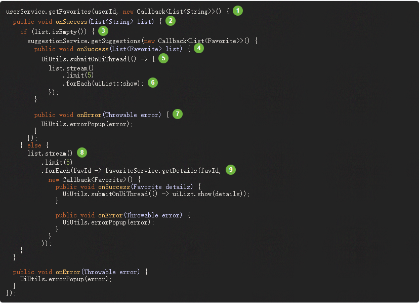
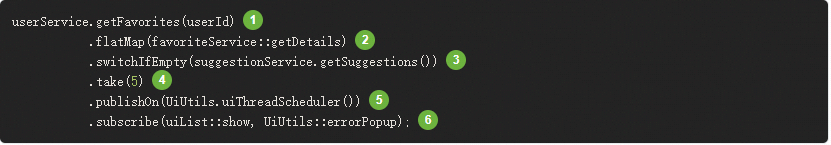
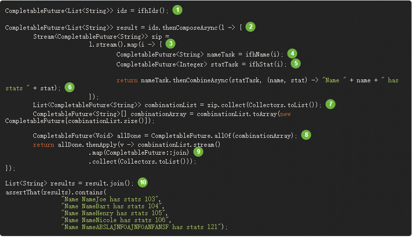
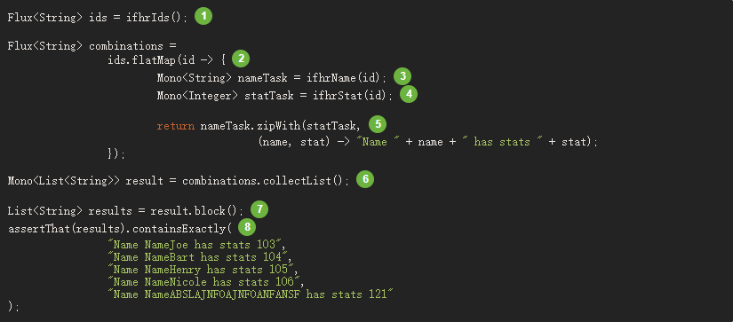

# Reactive Programming
什么是响应式编程：

```text
    响应是编程是一种异步编程的范例涉及数据流和变更传播。这意味着可以通过编程语言轻松的表达静态(例如数组)或者动态
(例如时间发射器)数据流。

    作为响应式编程的第一步，Microsoft在.NET生态系统中创建了了响应式拓展库(Rx)。然后RxJava在JVM上实现了响应式编程，
随着时间的流逝，通过Reactive Stream的努力，出现了Java的标准话，该规范定义了JVM上的响应库的一组接口和交互规则。它的接口
Flow.class已经在Java 9 被集成进去。

    反应式编程范例通常以面向对象的语言表示，作为Observer设计模式的扩展。您还可以将主要的反应流模式与熟悉的Iterator设计模式进
行比较，因为所有这些库中的Iterable-Iterator对都有双重性。一个主要的区别是，虽然Iterator是基于pull的，但反应式流是基于push的。

    使用迭代器是命令式编程模式，即使访问值的方法仅由Iterable负责。确实，开发人员可以选择何时访问序列中的next（）项。在反应式流中，
上述一对等效于Publisher-Subscriber。但是是发布者在新可用值到来时通知订阅者，而此推送方面是做出反应的关键。同样，应用于推入值的操作
以声明方式而不是命令方式表示：程序员表示计算的逻辑，而不是描述其确切的控制流程。

    除了推送值之外，还以明确定义的方式涵盖了错误处理和完成方面。发布者可以将新值推送到其订阅服务器（通过调用onNext），但也可以发出错误
信号（通过调用onError）或完成（通过调用onComplete）。错误和完成都会终止序列。可以总结如下：
onNext x 0..N [onError | onComplete]
    这种方法非常灵活。该模式支持没有值，一个值或n个值（包括无限个值序列，例如时钟的连续滴答声）的用例。

```

## 阻塞耗时

***为什么使用响应式编程***
```text
现代应用程序可以吸引大量的并发用户，即使现代硬件的功能不断提高，现代软件的性能仍然是关键问题。
广义上讲，有两种方法可以提高程序的性能：
[1] 并行使用更多线程和更多硬件资源。
[2] 在使用现有资源方面寻求更高的效率。

    通常，Java开发人员通过使用阻塞代码来编写程序。除非存在性能瓶颈，否则这种做法很好。然后是时候引入其他线程，运行类似的阻塞代码了。
但是，资源利用的这种扩展会迅速引入争用和并发问题。

    更糟糕的是，阻塞会浪费资源。如果仔细观察，程序一旦遇到一些延迟（特别是I / O，例如数据库请求或网络调用），就会浪费资源，因为线
程（可能有很多线程）现在处于空闲状态，等待数据。

    因此，并行化方法不是灵丹妙药。有必要访问硬件的全部功能，但是推理和资源浪费也很复杂。
```

## 异步救援

```text
    前面提到的第二种方法，寻求更高的效率，可以解决资源浪费的问题。通过编写异步的非阻塞代码，您可以将执行切换到使用相同基础资源的另
一个活动任务，并在异步处理完成后返回到当前进程。
但是如何在JVM上生成异步代码？Java提供了两种异步编程模型：
[1] Callbacks:异步方法没有返回值，但带有一个额外的回调参数（lambda或匿名类），该参数在结果可用时会被调用。一个著名的例子是Swing
的EventListener层次结构。
[2] Futures:异步方法立即返回Future <T>。异步过程计算T值，但Future对象包装对其的访问。该值不是立即可用的，并且可以轮询该对象，直
到该值可用为止。例如，运行Callable <T>任务的ExecutorService使用Future对象。

 这些技术够好吗？并非针对每个用例，这两种方法都有局限性。
 回调很难组合在一起，直接导致难以阅读和维护的代码（称为“回调地狱”）。
```

考虑一个示例：在用户界面上显示用户的前五个收藏夹，如果没有收藏夹则显示建议。这需要三项服务（一项提供喜欢的ID，第二项获取喜欢的详细
信息，第三项提供带有详细信息的建议），如下所示：



1. 我们提供基于回调的服务：一种回调接口，其中的一种方法在异步过程成功时被调用，而在发生错误时则被调用。
2. 第一个服务使用收藏夹ID列表调用其回调。
3. 如果该列表为空，则必须转到RecommendationionService。
4. RecommendationionService将List <Favorite>提供给第二个回调。
5. 由于我们处理的是UI，因此我们需要确保使用的代码在UI线程中运行。
6. 我们使用Java 8 Stream将处理的建议数限制为五个，并在UI的图形列表中显示它们。
7. 在每个级别，我们以相同的方式处理错误：在弹出窗口中显示它们。
8. 返回收藏夹ID级别。如果该服务返回了完整列表，则需要转到favoriteService获取详细的Favorite对象。由于我们只需要五个，因此我们首先传输ID列表以将其限制为五个。
9. 再次，回调。这次，我们得到了一个完整的“收藏夹”对象，将其推送到UI线程内的UI。

那是很多代码，很难遵循并且包含重复的部分。考虑它在Reactor中的等效功能：

1. 我们从收藏夹ID的流开始。
2. 我们将它们异步转换为详细的收藏夹对象（flatMap）。现在，我们有一个收藏夹流。
3. 如果“收藏夹”的流为空，则可以通过RecommendationionService切换到后备。
4. 我们最多只对结果流中的五个元素感兴趣。
5. 最后，我们要处理UI线程中的每个数据。
6. 我们通过描述如何处理数据的最终形式（在UI列表中显示）以及发生错误的情况（显示弹出窗口）来触发流程。


  如果您想确保在少于800毫秒的时间内检索到喜欢的ID，或者如果花费更长的时间从缓存中获取它们，该怎么办？在基于回调的代码中，这是一项
复杂的任务。在Reactor中，就像在链中添加超时操作符一样容易，如下所示：

[响应式设置超时](images/reactor-timeout.png)
1. 如果以上部分在800ms内没有发出任何光，则传播错误。
2. 如果发生错误，请退回到cacheService。
3. 链的其余部分与前面的示例相似。

```text
将来的对象比回调要好一些，但是尽管CompletableFuture对Java 8进行了改进，但它们在组合方面仍然表现不佳。一起编排多个Future对象是
可行的，但并不容易。
另外，未来还有其他问题：
1. 通过调用get（）方法很容易导致Future对象出现另一种阻塞情况。
2. 它们不支持惰性计算。
3. 他们缺乏对多个值和高级错误处理的支持。

再看一个例子：我们得到一个ID列表，我们要从中获取一个名称和一个统计信息，并将它们成对组合，所有这些信息都是异步的。下面的示例使用
CompletableFuture类型的列表执行此操作：
```



1. 我们从一个可以为我们处理的id值列表的feature开始。
2. 一旦获得列表，我们想开始更深入的异步处理。
3. 遍历列表中的每个元素
4. 异步获取关联名称。
5. 异步获取关联的任务。
6. 合并两个结果。
7. 现在，我们有了代表所有组合任务的期货清单。要执行这些任务，我们需要将列表转换为数组。
8. 将数组传递给CompletableFuture.allOf，该数组将输出一个Future，当所有任务完成时，该Future将完成。
9. 棘手的一点是allOf返回CompletableFuture <Void>，因此我们在期货列表上进行重申，并使用join（）收集其结果（这里不会阻塞，
因为allOf确保期货全部完成了）。
10. 一旦整个异步管道被触发，我们就等待它被处理并返回可以声明的结果列表。

由于Reactor提供了更多组合运算符，因此可以简化此过程，如下所示：


1. 这次，我们从异步提供的ID序列（Flux <String>）开始。
2. 遍历序列中的每个元素，我们都会对其进行两次异步处理（在主体flatMap调用的函数内部）两次。
3. 获取关联的名称。
4. 获取相关的统计信息。
5. 异步组合两个值。
6. 在值可用时将其汇总到一个列表中。
7. 在生产中，我们将通过进一步组合或订阅它来继续异步使用Flux。最有可能的是，我们将返回结果Mono。由于我们正在测试中，因此我们将阻塞，
等待处理完成，然后直接返回汇总的值列表。
8. 声明结果。

使用回调和Future对象的风险是相似的，并且是响应式编程在Publisher-Subscriber对中的作用。


## 从命令式编程到反应式编程

反应性库（例如Reactor）旨在解决JVM上“经典”异步方法的这些缺点，同时还关注其他一些方面：
* 可组合性和可读性
* 以丰富的运算符词汇操纵数据流
* 订阅之前没有任何反应
* 背压或消费者向生产者发出排放速率过高信号的能力
* 并发不可知的高级但高价值的抽象

### 可组合性和可读性

```text
所谓“可组合性”，是指协调多个异步任务的能力，其中我们使用先前任务的结果将输入反馈给后续任务。
或者，我们可以以fork-join样式运行多个任务。此外，我们可以将异步任务重用为更高级别系统中的离散组件。
编排任务的能力与代码的可读性和可维护性紧密相关。随着异步过程层的数量和复杂性的增加，能够编写和读取代码变得越来越困难。
如我们所见，回调模型很简单，但是它的主要缺点之一是，对于复杂的流程，您需要从一个回调中执行一个回调，它本身嵌套在另一个回调中，依此类推。
这种混乱被称为“回调地狱”。您可以猜测（或从经验中学到），很难找到这样的代码并进行推理。Reactor提供了丰富的组合选项，其中代码反映了抽象过
程的组织，并且通常将所有内容保持在同一级别（将嵌套最小化）。

原材料可以经过各种转换和其他中间步骤，也可以成为将中间零件聚集在一起的较大装配线的一部分。如果某一点有毛刺或堵塞（也许装箱的产品花费的时间不成比例），
那么受灾的工作站可以向上游发出信号，以限制原材料的流动。
```

### 操作员

```text
    在Reactor中，操作员是我们组装类比中的工作站。每个操作员都会向发布服务器添加行为，并将上一步的发布服务器包装到新实例中。因此，
整个链被链接在一起，这样数据就从第一个发布者发出并向下移动，并由每个链接转换。最终，订户完成了该过程。请记住，直到订阅者订阅发布
者为止，什么都不会发生，正如我们很快看到的那样。

    在Reactor中，操作员是我们组装类比中的工作站。每个操作员都会向发布服务器添加行为，并将上一步的发布服务器包装到新实例中。因此，整
个链被链接在一起，这样数据就从第一个发布者发出并向下移动，并由每个链接转换。最终，订户完成了该过程。请记住，直到订阅者订阅发布者
为止，什么都不会发生，正如我们很快看到的那样。

提示：
了解运算符会创建新的实例可以帮助您避免一个常见错误，该错误会导致您认为未应用您在链中使用的运算符。请参阅常见问题解答中的此项。

```


### 在您订阅之前，什么都不会发生

```text
    在Reactor中，当您编写发布者链时，默认情况下不会开始将数据泵入其中。相反，您可以创建异步过程的抽象描述（这有助于重用和组合）。
通过订阅，您将发布者与订阅者绑定在一起，从而触发了整个链中的数据流。这是通过从订阅服务器发出的单个请求信号在内部实现的，该请求
信号向上游传播，一直返回到源发布服务器。
```


### 背压

```text
    上游传播的信号也用于实现背压，我们在组装流水线中将其描述为当工作站的处理速度比上游工作站慢时，沿生产线向上发送的反馈信号。
    Reactive Streams规范定义的实际机制非常类似于此类比：订户可以以无界模式工作，并让源以最快可达到的速率推送所有数据，或者可
以使用请求机制向源发出信号，表明它是准备处理最多n素。
    中级操作员还可以在途中更改请求。想象一下一个缓冲运算符，它以十个为一组对元素进行分组。如果订户请求一个缓冲区，则源产生十个元素是
可以接受的。一些运算符还实现了预取策略，该策略避免了request（1）往返，如果在请求之前生成元素的成本不太高，则是有益的。     
    这将推模型转换为推挽混合模型，如果下游元素容易获得，则下游可以从上游拉取n个元素。但是，如果元素尚未准备就绪，则每当它们被生产时就会被上游推。
```
